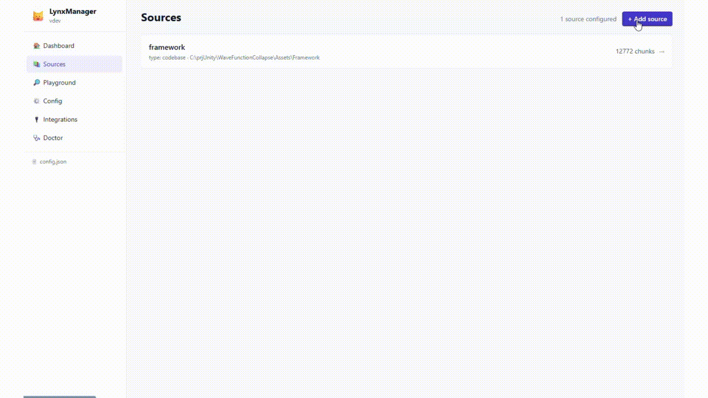
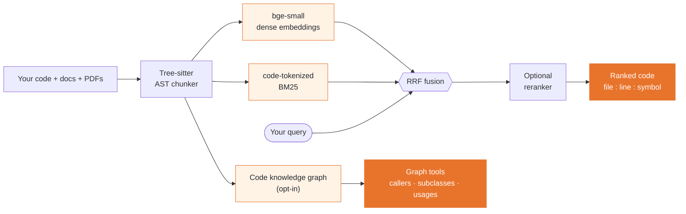

# Lynx

**A 100% local MCP server for semantic code search — AST-aware chunking, hybrid BM25 + dense retrieval, and an optional code knowledge graph. Works with any MCP client (Claude Code, Cursor, Windsurf, Antigravity, ...).**

[](https://github.com/lorenzo-cambiaghi/LynxMCP/actions/workflows/test.yml)
[](LICENSE)

[](https://glama.ai/mcp/servers/lorenzo-cambiaghi/LynxMCP)

[](https://glama.ai/mcp/servers/lorenzo-cambiaghi/LynxMCP)

Your AI assistant greps file names and guesses. Lynx gives it real retrieval over **your code, your library docs, and your PDFs** — without a single byte leaving your machine.

## 💸 What it saves you — every wrong file your AI opens is billed tokens

Agentic coding burns tokens re-reading files the assistant grepped into the wrong place. Lynx hands it the **right code in one tool call**, with `file:line` and symbol — measured on real codebases:

<div align="center">

| Tokens to get the answer into context | Agentic grep | **Lynx** | |
|---|---:|---:|:--|
| **Django 5.2** — Python, 158k lines | 4,150 | **1,725** | **−58%** |
| **Json.NET** — C#, 69k lines | 6,590 | **1,540** | **−77%** |
| **Guava** — Java, 181k lines | 5,892 | **807** | **−86%** |

</div>

Plus: `outline` triage is **2.4× fewer tokens**, and the code arrives in **1** tool call instead of 2+ (chunks included, with symbol + `file:line` + score). The token cut holds across languages — **even where grep ranks results just as well**, because Lynx returns the whole function in one call instead of match-lines plus a follow-up read.

**That's real money at today's frontier API prices.** For **25 engineers** (≈31,500 retrievals/month), the yearly API bill Lynx removes:


| Flagship model (input $/1M) | Django (Python) | Json.NET (C#) | Guava (Java) |
|---|---:|---:|---:|
| **Claude Fable 5** — Anthropic flagship ($10) | ≈ $85,000 | ≈ $95,000 | ≈ **$95,000** |
| **GPT‑5.5** — OpenAI flagship ($5) | ≈ $42,000 | ≈ $47,000 | ≈ **$47,000** |
| **Claude Opus 4.8** — top coding model ($5) | ≈ $42,000 | ≈ $47,000 | ≈ **$47,000** |

<sub>Token deltas are **measured** ([Django](benchmarks/RESULTS.md) · [Json.NET](benchmarks/RESULTS_csharp.md) · [Guava](benchmarks/RESULTS_java.md)). The yearly figures add **one** eliminated grep round‑trip re‑billing a 20k‑token context; the conservative floor (tool output only, zero assumptions) is **$0.4k–1.6k/mo** depending on model and codebase. **Run it for your own team, prices and codebase:** CLI `python benchmarks/savings_calculator.py --devs N`, or the interactive **[savings calculator](benchmarks/savings_calculator.html)** — pick the codebase and model from drop‑downs and edit the $/1M price live (presets in [`benchmarks/pricing.json`](benchmarks/pricing.json) + [`measured.json`](benchmarks/measured.json), yours to change).</sub>

---

- **AST-aware indexing** — tree-sitter parses 18+ languages and indexes whole functions/classes, not arbitrary text windows.
- **Hybrid retrieval** — dense embeddings + code-tokenized BM25, fused with RRF; optional cross-encoder reranker.
- **Token-efficient triage** — `view=outline` returns signatures instead of bodies, so an agent scans the candidates for **~2.4× fewer tokens** and reads only the code it picks ([measured](docs/OUTLINE.md)).
- **Code knowledge graph (opt-in)** — who-calls-what, inheritance, imports: ask "what breaks if I change this?" and get the actual blast radius — or **export it as a single, shareable, offline graph view** (`lynx graph export`).
- **Joinable as SQL** — search and the graph are also served as rows over a local HTTP API, so you can correlate your code with tickets, PRs, or logs in [DuckDB](docs/DUCKDB.md) or [Coral](docs/CORAL.md) — no data leaves your machine.
- **Multi-source** — index codebases, public docs sites (fetched once, on demand; JS-rendered SPAs supported via optional headless Chromium), and PDFs side by side.
- **Live index** — a file watcher re-indexes saves in ~2s. No manual rebuild ritual.
- **[Web manager UI](docs/GUIDE.md#lynxmanager--guided-setup-web-ui-diagnostics-new-in-v09)** — `lynx manager ui` gives you guided setup, a query playground, diagnostics, and client config snippets.

<p align="center">
  <a href="docs/GUIDE.md#lynxmanager--guided-setup-web-ui-diagnostics-new-in-v09">
    
  </a>
  <br>
  <sub><b><a href="docs/GUIDE.md#lynxmanager--guided-setup-web-ui-diagnostics-new-in-v09">LynxManager</a></b> — guided setup, query playground &amp; diagnostics, all in the browser. <a href="docs/GUIDE.md#lynxmanager--guided-setup-web-ui-diagnostics-new-in-v09">Full walkthrough →</a></sub>
</p>

<p align="center">
  
  <br>
  <sub><b>Shareable graph views</b> — <code>lynx graph export --symbol GetVoxel</code> writes one self-contained, offline file (no server, no CDN): the symbol's <b>blast radius</b> — who calls it (above) and what it calls (below). Attach it to a PR or archive it for an audit.</sub>
</p>

## Quickstart

```bash
# 1. Install the CLI (isolated, no venv ritual)
pipx install lynx-mcp
#    or: uv tool install lynx-mcp

# 2. Create a config pointing at your project
lynx manager init

# 3. Build the index (downloads the ~130MB embedding model on first run)
lynx build
```

Then register Lynx in your MCP client (Claude Code shown; see the [full guide](docs/GUIDE.md) for Cursor, Antigravity, and generic stdio clients — or let `lynx manager ui` generate the snippet for you):

```json
{
  "mcpServers": {
    "lynx": {
      "command": "lynx",
      "args": ["serve", "--config", "/absolute/path/to/config.json"]
    }
  }
}
```

Prefer zero terminal? There are [double-click installers](https://github.com/lorenzo-cambiaghi/LynxMCP/releases) for macOS and Windows.

## The tools your AI gets

The tool set is **fixed** — it does not grow with the number of sources, so your client's tool list (and context window) stays small. Tools take a `source` argument where relevant.

| Tool | What it answers |
|------|-----------------|
| `search(query, source?, outline?)` | Primary hybrid search. Omit `source` to search every source at once (RRF-fused). `outline=true` returns signatures-only for cheap triage (see below). |
| `deep_search(queries, source?)` | Escalation: tries multiple query phrasings until one passes a quality threshold. |
| `graph_query(operation, symbol?)` | `callers`, `callees`, `subclasses`, `superclasses`, `imports`, `neighbors`, `shortest_path`, `overview`, `surprising_connections`, `status`. |
| `find_definition(symbol)` | Where is X defined? (AST-precise when the graph is on, BM25 fallback otherwise.) |
| `find_usages(symbol)` | Every use of X — calls *and* non-call references (generics, decorators, docs). |
| `find_tests_for(symbol)` | Are there tests for X? |
| `find_similar(snippet)` | Does code like this already exist? |
| `search_diff(query, base?)` | Search only the files changed vs a base branch — built for code review. |
| `feedback(trying_to_do, tried, stuck)` | The agent files a report when the index couldn't answer — stored 100% locally, your signal for tuning sources. |
| `list_sources` / `get_rag_status` / `update_source_index` | Introspection and maintenance. |

All retrieval tools carry MCP `readOnlyHint` annotations (clients can auto-approve them), and the server ships its usage playbook in the MCP handshake (`instructions` + a `lynx://guide` resource) — your agent knows how to query well without any rules-file setup.

## How it works



Everything runs locally: HuggingFace models are downloaded once, then Lynx switches to offline mode. No telemetry, no cloud index, no code upload. The only network access is the model download and the *explicit* `webdoc` fetch step you trigger yourself.

## Why not just let the agent grep?

Grep is great when you know the identifier. It fails when you (or the agent) know the *behavior*: "where do we clamp the camera zoom?" matches nothing literal. Agentic grep also burns tokens — every wrong file the agent opens is context spent. Lynx answers behavioral queries in one tool call with file + line + symbol citations, and the graph layer answers structural questions (callers, inheritance) that grep fundamentally cannot — polymorphic dispatch leaves no textual trace.

Honest counterpoint: on a small repo that fits in the agent's context, built-in tools are fine. Lynx pays off on large codebases, on framework docs your model's training data has gone stale on, and on repeated sessions where re-exploring from scratch is waste.

## Benchmarks (reproducible)


On the `django/` package of Django 5.2 (883 files, ~158k lines), 20 behavioral questions with known ground-truth files — full methodology, per-task results, and an intentionally *strong* grep baseline in [benchmarks/RESULTS.md](https://github.com/lorenzo-cambiaghi/LynxMCP/blob/main/benchmarks/RESULTS.md):

| | Agentic grep | Lynx |
|---|---|---|
| median tokens **to answer** (tool output + required follow-up read) | 4,150 | **1,725** |
| tool round-trips before the code is in context | 2+ | **1** (chunks included, with symbol + file:line + score) |
| hit@1 / MRR | 45% / 0.64 | 55% / 0.67 |
| *"what inherits from `Field`?"* — full descendant tree (100 classes) | **101 grep rounds** | **4 graph calls**, same recall, file:line per edge |

The ranking quality is comparable (Django's docstring-rich code is grep's best case — we say so in the report). The structural difference is not: every tool round-trip is a full model inference over the growing context, and class-relation questions force grep into one round per discovered class while `graph_query` reads resolved inheritance edges.

**Second language, sparser docs — the gap widens.** The same test on **Json.NET (C#)** — `Src/Newtonsoft.Json/`, 240 files, 69k lines, 15 behavioral questions ([RESULTS_csharp.md](https://github.com/lorenzo-cambiaghi/LynxMCP/blob/main/benchmarks/RESULTS_csharp.md)). With C#'s PascalCase identifiers and fewer narrative comments, Lynx wins **every** metric, ranking included:

| | Agentic grep | Lynx |
|---|---|---|
| median tokens **to answer** | 6,590 | **1,540** (−77%) |
| hit@1 / MRR | 33% / 0.47 | **47% / 0.58** |

This is the counter-example the Django report predicts: move off grep's best case and the lexical baseline drops, while semantic retrieval holds.

**Third language, grep's *best* case — the token gap holds anyway.** **Guava (Java)** — `com/google/common/`, 606 files, 181k lines, 15 questions ([RESULTS_java.md](https://github.com/lorenzo-cambiaghi/LynxMCP/blob/main/benchmarks/RESULTS_java.md)). Guava's self-documenting class names (`BloomFilter`, `RateLimiter`, `Splitter`) are *ideal* for lexical search — so here grep actually **out-ranks** Lynx. The metric you pay for still collapses:

| | Agentic grep | Lynx |
|---|---|---|
| median tokens **to answer** | 5,892 | **807** (−86%) |
| hit@1 / MRR | **73% / 0.81** | 60% / 0.70 |

**The honest takeaway across all three.** Ranking parity swings with how self-documenting the code is — Lynx ahead on C#, level on Python, behind on Guava. But the **token cost — the line on your invoice — drops 58–86% every time**, because Lynx hands back the whole function in one call instead of match-lines plus a follow-up read. That's the number that scales to a team's monthly bill.

```bash
# reproduce — Python (Django)
git clone --depth 1 --branch 5.2 https://github.com/django/django.git benchmarks/_target/django
python benchmarks/run_benchmark.py && python benchmarks/structural_demo.py

# reproduce — C# (Json.NET)
git clone --depth 1 https://github.com/JamesNK/Newtonsoft.Json.git benchmarks/_target/jsonnet
python benchmarks/run_benchmark.py --tasks benchmarks/tasks_jsonnet.json \
  --target-dir benchmarks/_target/jsonnet --storage-dir benchmarks/_storage_csharp \
  --results-json benchmarks/results_csharp.json --results-md benchmarks/RESULTS_csharp.md

# reproduce — Java (Guava)
git clone --depth 1 https://github.com/google/guava.git benchmarks/_target/guava
python benchmarks/run_benchmark.py --tasks benchmarks/tasks_guava.json \
  --target-dir benchmarks/_target/guava --storage-dir benchmarks/_storage_java \
  --results-json benchmarks/results_java.json --results-md benchmarks/RESULTS_java.md
```

## Two ways to read a result: full vs outline

Every Lynx search ranks the same way (hybrid dense + BM25 over whole functions). What differs is **how much of each hit you pull into the model's context**:

- **Full search** (default) returns the matching functions *with their bodies* — `file`, `symbol`, line range, `score`, and the real `content`. The model has the code immediately: one tool call and it can explain, review, or edit.
- **Outline search** (`search(query, outline=true)` from an MCP agent, or `?view=outline` over HTTP) returns the same ranked hits but **drops the bodies** — just a one-line `signature` plus the first line of the docstring. The model scans the candidates to decide *which* one it needs, then reads that single body on demand (every row still carries `file_path` + `start_line`/`end_line`). The agent is told *when* to reach for it in the tool description and the MCP handshake instructions.

It's **progressive disclosure**: triage cheap, fetch deep only where it pays. Most of the bodies in a result set are ones the model will never use — outline stops paying for them up front. On a public repo (`psf/requests`) it cut the search step to **~2.4× fewer tokens** — [measured, with the chart](docs/OUTLINE.md).

```jsonc
// full          →  { …, "content": "<the whole 64-line iter_content method>" }
// view=outline  →  { …, "signature": "def iter_content(self, chunk_size=1, decode_unicode=False)",
//                        "doc": "Iterates over the response data." }
```

**When to use which — there's no silver bullet:**

| Use **full** (default) when… | Use **outline** when… |
|---|---|
| You'll use the code *now* — explain, review, or edit a specific area | You're navigating: "where is X / which function does Y" |
| Few, precise results; you already know roughly what you want | Broad or exploratory queries, or a large `top_k` |
| The body *is* the answer (a one-shot question) | Building a mental map, or chaining many searches |
| | Context budget is tight (large repos, long sessions) |

Rule of thumb for an agent: **triage with `outline`, then pull the one body you need** — a follow-up `full` search or a direct read of the cited line range. (`view` is opt-in; the default is unchanged, so Coral / DuckDB are unaffected.)

## Lynx + Coral: your code, joined with everything else

[Coral](https://github.com/withcoral/coral) turns your live tools — GitHub, Sentry, Jira, Linear — into one local SQL interface. Plug in Lynx ([source spec](integrations/coral/manifest.yaml)) and **your codebase becomes a queryable source too**: ask in plain language, get ranked code locations back, and **correlate them with the tools your team already lives in** — without a byte leaving your machine.

> You register Lynx as a Coral source yourself today — `coral source add --file integrations/coral/manifest.yaml` (full steps in [docs/CORAL.md](docs/CORAL.md)). A community-source PR to ship it in Coral's registry is approved and awaiting merge.

What that unlocks:

- 🔎 **Find logic by behavior, not keywords.** *"Where do we validate session tokens?"* returns the actual functions — file, symbol, line, score — even when nothing matches literally.
- 🔁 **Refactor without surprises.** Locate the code behind a feature and line it up against the repo's open PRs in one query — see who's already in there before you touch it.
- 🚨 **Triage crashes to code.** Take the behavior from a Sentry alert and get the ranked code locations; when your source exposes a file column, correlate them with the live issues.
- 🎫 **Turn a backlog into a map.** Pull your open tickets from Coral and — with the included Python helper — batch-search Lynx to surface the likely code area for each.
- 🔒 **100% local.** Repo and embeddings never leave your machine; only the live-data side hits an API.

Once the idea clicks, the syntax is just SQL:

```sql
-- ranked code for a behavioral question (C# only)
SELECT file, symbol, score
FROM lynx.search(q => 'where the camera zoom is clamped')
WHERE language = 'c_sharp'
ORDER BY score DESC
LIMIT 5;
```
```sql
-- top code matches for a question, next to the repo's open PRs
SELECT s.file, s.symbol, s.score, p.html_url
FROM lynx.search(q => 'retry logic for payment webhooks') s
CROSS JOIN github.pulls p
WHERE p.owner = 'your-org' AND p.repo = 'your-repo' AND p.state = 'open'
ORDER BY s.score DESC;
```

*The search string is a literal you pass (Coral resolves table-function arguments at plan time) — so it's code search as a **joinable** source, not a per-row enrichment. For one search per row of another table, use the batch endpoint + the Python helper. `lynx.sources` lists your indexed sources; `lynx.search(q => '…')` is the ranked search function (`source => '…'`, `top_k => N` to narrow it). Full setup in **[docs/CORAL.md](docs/CORAL.md)**.*

## Lynx + DuckDB: code search as a local SQL table

Lynx serves its search **and** its code graph as NDJSON over a local HTTP API, and [DuckDB](https://duckdb.org) reads that URL straight into a table. So you can JOIN your code with **anything DuckDB reads** — Parquet, CSV, SQLite, Postgres, a git log, a JSON log — in one engine, on your machine, with no plugin and no service to run.

- 🦆 **Zero setup.** `read_ndjson_auto('http://127.0.0.1:8765/api/v1/search?…')` is a table. No connector, no daemon.
- 🔗 **Join with any local data.** Cross code relevance with git churn, error logs, ownership, ticket exports — whatever you can read.
- 🧪 **Total flexibility.** Shape and filter in SQL, then hand a tiny, hyper-targeted context to an LLM or a notebook.

```sql
-- code search as a table
SELECT file, symbol, score
FROM read_ndjson_auto(
  'http://127.0.0.1:8765/api/v1/search?q=where%20we%20validate%20session%20tokens&format=ndjson')
ORDER BY score DESC;
```
```sql
-- regression hunting: code related to login that is ALSO churning in git
WITH churn AS (
  SELECT path, count(*) AS commits, max(date) AS last_modified
  FROM read_csv('churn.csv', header = false,
                columns = {'path': 'VARCHAR', 'date': 'DATE'})   -- from a one-line git log
  GROUP BY path
)
SELECT c.path, c.commits, h.symbol, h.score
FROM read_ndjson_auto(
       'http://127.0.0.1:8765/api/v1/search?q=user%20login%20and%20token%20validation&format=ndjson') h
JOIN churn c ON h.file = regexp_replace(c.path, '.*/', '')
WHERE c.commits >= 2
ORDER BY c.last_modified DESC, h.score DESC;
```

The code graph is one URL away too (`…/api/v1/graph?operation=callers&symbol=…`), so you can pivot a hit to its blast radius and join *that* with your data. Recipes for git freshness, error-log triage, and per-row batch search in **[docs/DUCKDB.md](docs/DUCKDB.md)**.

## Documentation

| | |
|---|---|
| [Full guide](docs/GUIDE.md) | Configuration, all source types (codebase / webdoc / PDF), retrieval internals, troubleshooting |
| [Manager UI](docs/GUIDE.md#lynxmanager--guided-setup-web-ui-diagnostics-new-in-v09) | Guided setup, playground, diagnostics |
| [Use Lynx from Coral](docs/CORAL.md) | SQL over your code search: `SELECT ... FROM lynx.search` joined with live GitHub/Sentry data |
| [Use Lynx from DuckDB](docs/DUCKDB.md) | `read_ndjson_auto('…/api/v1/search?format=ndjson')` — join code search + the code graph with any local data |
| [Outline mode (token-efficient triage)](docs/OUTLINE.md) | `view=outline` — signatures instead of bodies; ~2.4× fewer tokens, with the measured data + chart |
| [MCP recipes](docs/MCP_RECIPES.md) | Agent patterns combining Lynx with GitHub/Sentry/Jira MCP servers (triage, PR impact, ticket→code) |
| [PR impact analysis (GitHub Action)](integrations/github-action/) | On every PR, comment with the downstream callers + semantically related code, indexed locally on the runner |
| [Steampipe plugin (design spec)](integrations/steampipe/DESIGN.md) | Spec for a SQL plugin exposing `lynx_source`/`lynx_search`/`lynx_graph`, joinable with Steampipe's connectors — implementation TBD |
| [config.example.json](config.example.json) | Annotated example configuration |

## Status

Actively developed by one author; APIs may still move before 1.x stabilizes. Issues and PRs welcome — the test suite runs with `pytest` and CI must stay green. See [ROADMAP.md](ROADMAP.md) for what's under consideration (and what's explicitly *not* planned).

## License

[Apache 2.0](LICENSE)

---

<!-- MCP Registry ownership marker — must stay in the README published on
     PyPI so registry.modelcontextprotocol.io can verify the package.
mcp-name: io.github.lorenzo-cambiaghi/lynx
-->

