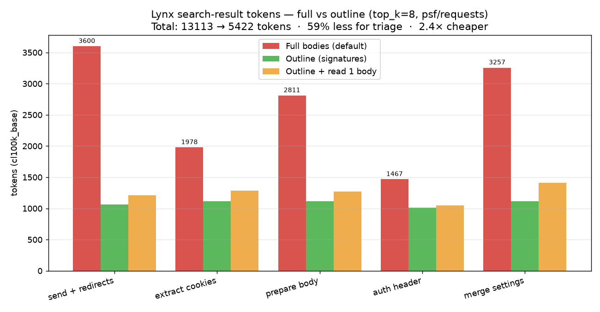

# Outline mode — triage by signature, fetch the body on demand

`GET /api/v1/search?...&view=outline` returns each hit **without its body** —
just a compact `signature` + `doc` — so an agent can scan the candidates cheaply
and read the full code of *only* the one it picks. On a real codebase this is
**~2.4× fewer tokens** for the search step (measured below, reproducibly).

## The problem it solves

Default search returns whole functions (good — not arbitrary text). But to decide
*which* of 8 hits is the right one, the model pays for **all 8 bodies** up front.
That's exactly the "context rot" that makes agents worse: most of those tokens are
bodies it will never use.

## How it works

`view=outline` drops `content` and adds two small fields, keeping everything else:

```jsonc
// view=outline row — a real result from psf/requests
{
  "source": "requests", "file": "models.py", "file_path": "…/requests/models.py",
  "symbol": "Response.iter_content", "kind": "function_definition",
  "language": "python", "start_line": 914, "end_line": 977, "score": 0.0161,
  "signature": "def iter_content( self, chunk_size: int | None = 1, decode_unicode: bool = False ) -> Iterator[str | bytes]",
  "doc": "Iterates over the response data.  When stream=True is set on the"
}
```

A 64-line method collapses to one line + a docstring snippet. The row still has
`file_path` + `start_line`/`end_line`, so the agent **reads the real body on
demand** with its own file tool — paying for one body, not eight.

```
1.  GET /api/v1/search?q=...&view=outline   → triage on signatures   (cheap)
2.  agent picks one symbol
3.  reads file_path : start_line-end_line   → the full body          (one read)
```

It's a **query-time transform** — no reindex, no `CHUNKER_VERSION` bump, no LLM,
100% local. It composes with `format=ndjson`. The default (`view=full`) is
unchanged, so Coral / DuckDB / existing consumers are unaffected.

## The data (measured on a public repo)

Run against **[psf/requests](https://github.com/psf/requests)** — a public repo
anyone can clone and index — `top_k=8`, 5 behavioural queries, token counts via
`tiktoken` `cl100k_base`. The numbers come straight from the real `view=full` vs
`view=outline` endpoints via `benchmarks/outline_tokens.py`.



| Query | hits | Full | Outline | Outline save | Outline + read 1 body | Net save |
|---|---|---|---|---|---|---|
| send + redirects | 8 | 3600 | 1061 | 70.5% | 1213 | 66.3% |
| extract cookies | 8 | 1978 | 1116 | 43.6% | 1285 | 35.0% |
| prepare body | 8 | 2811 | 1116 | 60.3% | 1270 | 54.8% |
| auth header | 8 | 1467 | 1014 | 30.9% | 1049 | 28.5% |
| merge settings | 8 | 3257 | 1115 | 65.8% | 1410 | 56.7% |
| **TOTAL** | 40 | **13113** | **5422** | **58.7%** | **6227** | **52.5%** |

**Full bodies cost 2.42× the outline triage (−59%)** — and even the realistic
flow (outline + actually reading the one chosen body) is **2.11× cheaper / ~53%
less**. (No cherry-picking: the weakest query, "auth header", still saved 31%.)

## Reproduce it

```bash
git clone --depth 1 https://github.com/psf/requests
# Index ./requests as a Lynx codebase source named "requests"
# (lynx manager ui → + Add your first source → point at the clone), then:
pip install tiktoken matplotlib
lynx manager ui --port 8765 --no-browser &
python benchmarks/outline_tokens.py --source requests --chart /tmp/outline.png
```

Or just diff one query by eye:

```bash
curl 'http://127.0.0.1:8765/api/v1/search?q=iterate%20over%20the%20response%20content&top_k=8'
curl 'http://127.0.0.1:8765/api/v1/search?q=iterate%20over%20the%20response%20content&top_k=8&view=outline'
```

## Honest caveats

- **Savings scale with body size.** Big methods → 60–70% less; a query that hits
  tiny one-liners → ~30%, because the fixed row fields (symbol/file/lines/score)
  are a floor. Outline helps most on the common "find the logic" queries that
  land on substantial functions.
- **`doc` depends on the language.** Python/Ruby keep the docstring *inside* the
  body, so it lands in the chunk and `doc` is populated (as above). C#-style
  `///` doc precedes the node and isn't in the chunk → `doc` is empty there; the
  signature alone still does the bulk of the saving.
- **Non-code chunks** (plain text / unsupported files, `kind: text_window`) have
  no real signature — the row gives a clean first-line **preview** instead.
  (`requests` is pure Python, so there were none here.)
- **The signature is heuristic** (chunk text up to the body opener). Exotic
  multi-line signatures or macros may render a less-clean one-liner — but no
  information is lost: the row still carries `file_path` + line range to read the
  real code.

See [docs/DUCKDB.md](DUCKDB.md) / [docs/CORAL.md](CORAL.md) for the rest of the
`/api/v1` surface.
